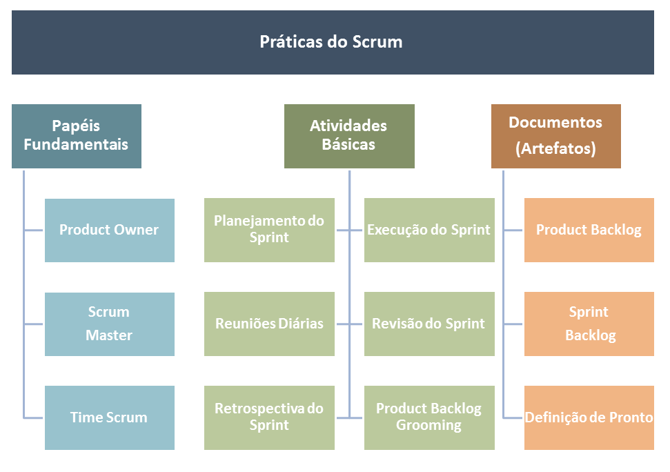

# Práticas Ágeis

## Objetivo

O objetivo deste documento é demonstrar algumas das ferramentas e oferecer acesso a recursos que podem ser utilizadas em metodologias ágeis.

# Implementação das Práticas Ágeis

O desenvolvimento baseado em metodologias ágeis tem por objetivo minimizar o risco de desenvolver softwares através de iterações em pequenos ciclos de desenvolvimento. [Scrum](https://www.scrum.org/), [EXtreme Programming](http://www.extremeprogramming.org/) e [Kanban](https://www.scrum.org/resources/kanban-guide-scrum-teams) são algumas das formas de aplicar os conceitos de uma metodologia ágil. Estes são os [princípios do ágil](https://agilemanifesto.org/iso/ptbr/manifesto.html):

- Indivíduos e interações mais que processos e ferramentas;

- Software em funcionamento mais que documentação abrangente;

- Colaboração com o cliente mais que negociação de contratos;

- Responder a mudanças mais que seguir um plano;

# Scrum

## Características do Scrum:

- Trabalho em sprints: [Uma sprint é um ciclo de desenvolvimento](https://www.scrum.org/resources/what-is-a-sprint-in-scrum) com datas de início, data de fim e tarefas bem definidas.
- Times pequenos, autogerenciáveis, com papéis bem definidos e focados em um objetivo

## Ferramentas do Scrum:

- Reunião de Planejamento ([Sprint Planning](https://www.scrum.org/resources/what-is-sprint-planning)): Reunião realizada ao se iniciar uma Sprint para determinar o que será feito na Sprint e quem será o responsável por cada tarefa;

- [Daily Meetings](https://www.scrum.org/resources/what-is-a-daily-scrum): Reuniões para acompanhar o andamento da Sprint diariamente em reuniões rápidas de poucos minutos (também conhecido como stand-up meeting);

- [Revisão](https://www.scrum.org/resources/what-is-a-sprint-review) e [Retrospectiva da Sprint](https://www.scrum.org/resources/what-is-a-sprint-retrospective): Reunião que ocorre no final de uma Sprint para pontuar o que deu certo, o que deu errado, e identificar dívidas técnicas, para fazer a melhoria contínua do processo de trabalho;

- Parking lot: quando alguém do time precisa de mais tempo para discutir algo que vai além da daily, isso vai para o “parking lot”. Cabe à quem conduz a daily perguntar se alguém tem algo para o “parking lot” e cabe também a cada indivíduo expressar verbalmente, de preferência, quando tiver algum assunto para discutir depois da daily. Quando necessário, recomenda-se que a daily seja encerrada e que outra reunião inicie-se na sequência para o parking lot, com a presença das pessoas que realmente sejam necessárias para o(s) assunto(s).

## Cargos no Scrum e responsabilidades:

- Product Owner: Responsável por cuidar dos requisitos de software e garantir a qualidade do produto;

- Scrum Master: Responsável por garantir o funcionamento das práticas ágeis, ajudar na comunicação e remoção de impedimentos;

- DevOps: Responsável garantir a entrega do software nos ambientes de homologação e/ou produção;

- Time: Demais desenvolvedores, responsáveis pela realização de tarefas;

## Artefatos gerados no Scrum:

- Product Backlog: lista de histórias de usuário de todo o produto;

- Sprint backlog: lista de histórias de usuário da  sprint;

# Kanban

# XP

Extreme Programming (XP) é um framework ágil de desenvolvimento de software cujos principais objetivos são produzir software de melhor qualidade e melhorar a qualidade de vida do time de desenvolvimento [3].

O XP possui vários valores e diversas práticas. Como parte de toda a proposta para a melhor organização e para uma engenharia de software mais estruturada nos projetos do Latitude, apenas algumas das práticas e parte dos valores do XP serão introduzidos nesse primeiro momento de mudanças.

Entretanto, espera-se que, ao passar do tempo, os times dos projetos do Latitude fiquem mais familiarizados com as práticas ágeis aqui sugeridas. Assim, novas metodologias ou outros valores e práticas do XP poderão ser apresentados.

## Valores do XP

São 5 ao todo, todos muito importantes e têm como objetivo trazer melhorias para a equipe em vários âmbitos, o que afeta na qualidade do trabalho e resulta em software bem feito.

Embora possa parecer pouco ter somente 5 valores, prefere-se focar, inicialmente, em apenas 3 deles. Isso para não causar uma chuva de informações e de práticas nos indivíduos. Com o tempo, os valores estarão presentes na cultura da organização de modo natural ao ponto dos outros valores começarem a ser explorados mais facilmente.

Sendo assim, inicialmente sugere-se o foco nos seguintes valores: **comunicação, simplicidade e respeito**. Posteriormente serão introduzidos os valores restantes: *feedback* e coragem.

Agora vejamos cada um dos valores na íntegra:

- Comunicação: desenvolver software requer uma equipe disciplinada e colaborativa. A comunicação é chave para que o conhecimento e a informação sejam transferidos de um membro para cada outro na equipe. O XP reforça a importância da comunicação de forma apropriada, ou seja, dando preferência para conversas face-a-face com o suporte de algum mecanismo de desenho (ex.: quadro branco);

- Simplicidade: significa fazer a coisa mais simples e funcional. Isso evita fazer o que é desnecessário e traz o foco para aspectos mais importantes, como manter o projeto (design) do sistema o mais simples possível. Assim, manter, dar suporte e revisar o software fica mais fácil;

- Respeito: é preciso haver um respeito mútuo entre todos os membros do time para que possam se comunicar, além de fornecer e aceitar feedback que honre o relacionamento. Além disso, com respeito o time trabalha junto para identificar soluções e projetos simples.

## Práticas do XP

O ponto central do XP é o conjunto de suas práticas interconectadas. Embora seja possível adotá-las de modo isolado, muitos times perceberam que algumas delas reforçam outras, logo deveriam ser praticadas em conjunto.

Mesmo assim, como mencionado anteriormente, a ideia não é causar transtorno de informações e de metodologias para as equipes, mas sim promover uma melhora no ambiente de engenharia de software de modo gradual e saudável.

Com isso, as principais práticas a serem adotadas em um primeiro momento são explicadas a seguir.

- O time todo (Whole Team): ter um grupo funcional de pessoas de diferentes áreas e com cargos necessários para desenvolver um produto. Esse é o time. Isso significa que pessoas com uma demanda, assim como aquelas que participam da realização dessa demanda de alguma forma, trabalham juntas, diariamente, para alcançar certo resultado;

- Programação em pares: consiste em 2 pessoas trabalhando com código juntas no mesmo equipamento. Pode ser executado de forma remota por meio de reunião virtual e compartilhamento de tela, por exemplo. A ideia é ter mais olhos e mentes focados em determinada tarefa, ao mesmo tempo em que ocorre uma revisão contínua do que está sendo feito, além de gerar uma resposta mais rápida a problemas que possam surgir. Times que utilizam essa prática relatam que ela promove um maior foco na realização da tarefa e não leva mais tempo do que o esperado, além de criar menos código para alcançar um objetivo. Para praticar isso, enquanto uma pessoa escreve o código, a outra atua com atenção como revisora. A dupla pode intercalar os papéis de programador de tempo em tempo, caso queiram, enquanto colaboram e se comunicam;

- Histórias: são descrições sobre o que o produto deveria fazer em termos significativos para os clientes e usuários. A recomendação é que as histórias sejam breves, curtas, servindo para o planejamento do que tem que ser feito e atuando como lembretes para conversas mais detalhadas quando o time se reunir para realizar aquela história em particular;

- Ciclo semanal: também chamado de iteração. O time se reúne no começo do ciclo para planejar as histórias que serão feitas, à escolha do cliente, e os responsáveis por elas. O time também decide como vão abordar cada história para que, ao final do período, tenham em funcionamento os recursos (as features) já testadas. A intenção dessa entrega com data marcada por ciclo é ter algo para que o usuário veja e dê feedback;

- Integração Contínua (CI): é a prática na qual mudanças no código são imediatamente testadas quando adicionadas a uma base de código maior. O benefício disso é conseguir encontrar e consertar problemas assim que eles aparecem. Para realizar essa prática, comumente utiliza-se pipelines, testes automatizados, políticas e outros recursos associados ao DevOps.

### Recursos úteis

[1] [Manifesto Ágil](https://agilemanifesto.org/iso/ptbr/manifesto.html)

[2] [Os 12 Princípios do Software Ágil](https://agilemanifesto.org/iso/ptbr/principles.html)

[3] [What is Extreme Programming?](https://www.agilealliance.org/glossary/xp/)

[4] [Extreme Programming: A gentle introduction](http://www.extremeprogramming.org)

[5] [The Rules of Extreme Programming](http://www.extremeprogramming.org/rules.html)

[6] [What is Scrum ?](https://www.scrum.org/resources/what-is-scrum)
